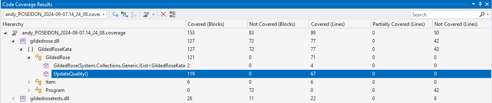

# Gilded Rose Solution by Andrew Bates

## Initial Thoughts

1. Code looks perfect; what else is there to do?!? Joking...
2. UpdateQuality is code in a complex manner using negated conditions which are difficult to follow, maintain and extend.
3. Item class cannot be changed so we cannot just add interfaces/polymorphism to tidy the code.
4. Initial thought is to use the Decorator pattern to wrap the Item and add extra functionality that way.
5. To also use a Factory class to construct the new decorated classes. Using the name is not ideal but it is how we're going to have to work.
6. One blanket test is not sufficient we need individual tests with 100% coverage to be able to refactor consistently.
7. Sulfuras seem to break the Quality not larger than 50 requirement so is an outlier.
8. Code is using a for loop; could replace with foreach and remove Items[index] statements.
9. Code isn't using ++/-- operators and many of the expressions can be simplified.
10. UpdateQuality method could be refactored; not sure whether this is better than writing code from scratch. Instructions say to refactor so that is what I will do.
11. Some products don't have special quality rules; these are treated as regular products.

## Gilded Rose Tasks

1. Create unit tests to provide 100% coverage of the UpdateQuality method. `Done`

2. Refactor UpdateQuality method. `Done; condition is clearer and matches requirements.`
3. Create decorator items and factory. Update quality in decorated items. `Done`
4. Add new Conjured item and update tests. `Done`
5. Final quality check and tweaks. `Done`
